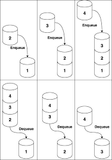
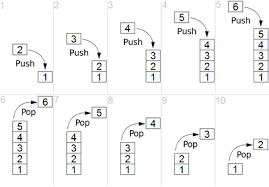
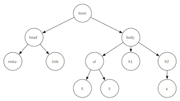

## Lista ligada
Coleção ordernada de valores onde cada elemento aponta para o próximo 

(Diferença de Js pra outras linguagens)

## Array
Coleção de elementos que podem ser identificados por um índice

(Métodos: push, pop, unshift, shift, length e etc...)

## Fila (Queue)
Coleção de elementos onde o primeiro elemento 

## Pilha (Stack)
Coleção de elementos onde o primeiro elemento a ser retirado deve ser o último elemento adicionado. Last-in / First-out

## Árvore (Tree)
Conjuntos de elementos chamados de nós (ou nodes) organizados em estrutura hierárquica (não sequencial), ou seja, podendo estar "abaixo" ou "acima" de outros nós.

Em Javascript:
  Lista == Array
  Dicionário == Objeto

Valor != Referência

